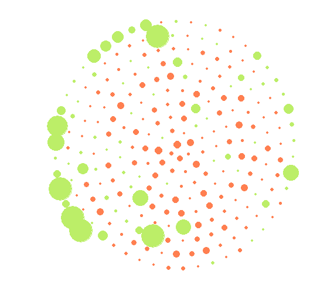
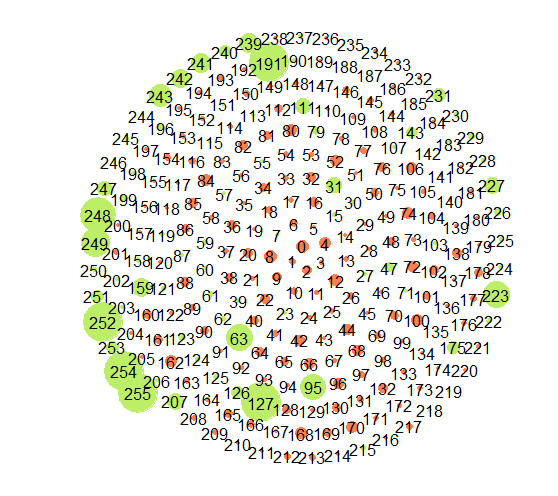
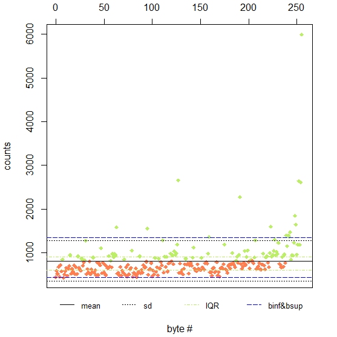
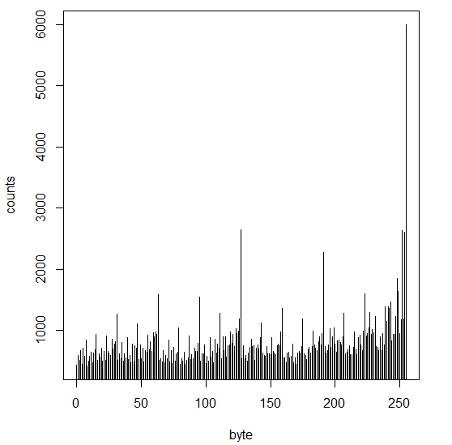
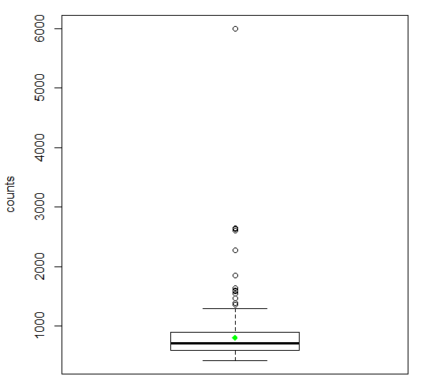

## Description

*bytescircle* is a function that shows statistics about bytes contained in a file 
as a circle graph of deviations from mean in sigma increments. 
Histogram and boxplot graphs can also be generated.   

The function can be useful for statistically analyze the content of files 
in a glimpse: text files are shown as a green centered crown, compressed 
and encrypted files should be shown as equally distributed variations with 
a very low CV (sigma/mean), and other types of files can be classified between 
these two categories depending on their text vs binary content, which can be 
useful to quickly determine how information is stored inside them (databases, 
multimedia files, etc).   

bytescircle() accepts a character string as path for the file, though if 
it is not indicated, a file selection GUI will demand it.
The 'ascii=TRUE' param replicates the linux behaviour of **bytes-circle** command
with params '-o 1' (or equivalently '-b'), as R output does not have 
colour output. bytescircle's linux command examples [can be found here](https://circulosmeos.wordpress.com/2015/10/10/statistics-circle-for-analysing-byte-entropy-in-files/).

bytescircle() outputs data (file, mean, sd, CV, file size) on R console, but
this can be turned off using 'output=0'. A value of 2 will output the char 
array used for ascii graph output.   

'plot' param accepts a number from 0 (no plot) to 5 (boxplot)    

Colours can be indicated as a vector of colours from 1 to 3 elements, which
will be used differently depending on the plot selected. By default, the
first colour of the vector will replace the default green, the second the 
default red, and the third the default blue. Not all colours are used on 
every plot.   

bytescircle() can accept its own output as input using 'input=variable'.
This can be useful for generating a new graph without the hassle of R reading
and analysing the file again. The input can also be a bare 256 element vector:
in this case each element represents the appeareances in the file of that 
[n-1] byte value.   

## bytescircle() parameters

*FILE* char array with the path to an existing file to analyse. If it is not indicated,
   a file selection GUI will demand it.   

*ascii* boolean, if TRUE R will output an ascii circle char of deviations
   from sigma (true sd). Each ascii char represents a different deviation from
   sigma. The array of chars used (from -9/4 to +9/4 sigma, in increments 
   of 0.5 sigma) can be printed using parameter 'output=2'   

*plot* number from 0 to 5, indicates plot to represent:

   0: no plot  

   1: circle of bytes: using an archimedean spiral each byte value is represented
      with a coloured circle which size indicates the amount of deviation from 
      sigma. A green colour indicates positive sigma value whilst red indicates
      a negative sigma value. Blue little circles represents byte values that do
      not appear in the file   

   2: circle of bytes with indication of the byte bucket represented   

   3: graph of byte counts: in green values over mean, in red values below it.
      Also the lines for +/- sd over mean (black dotted line), IQR (Interquartile 
      Range) (dotted green line), and boxplot's binf and bsup values (dotted blue)
      values are represented as horizontal lines   

   4: bar graph of byte counts   

   5: boxplot() graph of byte's data   

   Note that ascii parameter's value is independent of the value of 'plot'   

*col* vector of color values, colours can be indicated as a vector of 
   colours from 1 to 3 elements, which will be used differently depending on the 
   plot selected. By default, the first colour of the vector will replace the 
   default green, the second the default red, and the third the default blue. 
   Not all colours are used on every plot.   

*output* integer (0, 1, 2), as function outputs data (file, mean, sd, 
   CV, file size) on R console after every call, this output can be turned 
   off using 'output=0'. A value of 2 will output the char array used for ascii 
   graph output.   

*input* factor or vector, the function can accept its own output as input.
   This can be useful for generating a new graph without the hassle of R reading
   and analysing the file again. The input can also be a bare 256 element vector:
   in this case each element represents the appeareances in the file of that 
   [n-1] byte value.   

## Return value

Returns factor of values :   

   $bytes: vector of 256 elements, counts of each byte value in the file   

   $deviation: vector of 256 elements, (count-mean)/sigma for each byte value in the file   

   $file: char array, input file analysed. If input were a variable, it is "R input"   

   $mean: mean value   

   $sd: sd value   

   $cv: coefficient of variation (mean/sigma*100)   

   $circle: complex matrix representing an ascii circle: each element is the 
       deviation from sigma of the represented byte. Elements which do not 
       represent bytes get the value '0+1i'.   

\newpage

## Examples

```{r eval=FALSE}
BYTES = bytescircle( '/R/.RData', plot=1 )
bytescircle( input=BYTES, plot=2 )
```

```{r, out.width = "250px", echo=FALSE, fig.show="asis"}


```

Using an archimedean spiral, each byte value is represented
with a coloured circle which size indicates the amount of deviation from 
sigma. A green colour indicates positive sigma value whilst red indicates
a negative sigma value. Blue little circles represents byte values that do
not appear in the file.   
   
\newpage
   
```{r eval=FALSE}
bytescircle( input=BYTES, plot=3 )
```

```{r, out.width = "300px", echo=FALSE}

```

```{r eval=FALSE}
bytescircle( input=BYTES, plot=4 )
```

```{r, out.width = "250px", echo=FALSE}

```

```{r eval=FALSE}
bytescircle( input=BYTES, plot=5 )
```

```{r, out.width = "250px", echo=FALSE}

```

Note that an *ascii=TRUE* parameter would print an ascii circle on R output (and this is independent of *plot* parameter value):   
``````{r eval=FALSE}
bytescircle( "bytecircle.Rmd", plot=1, ascii=TRUE )
```
                                    
               ======               
           = ==============         
          =======oO@*#**=====       
         ====*@**=*=****======      
       =====o=****===@**=*@=====    
       ====@*=*==O=====****@====    
       ====@==*==O======***@====    
       ====****=========***O====    
       =====o=***=====***==*====    
        ====**@**********@=====     
          =====******OO*#=====      
           =================        
              ==========            
                                    
file =  ./bytescircle.Rmd   
mean =  25.914   
sigma=  103.628 ( CV=  399.8927 \% )   
size =  6.48 kiB  ( 6634 bytes)   

This mimics linux bytes-circle command ouput with options not to show colours (*-o 1*, or *-b*)
as R console does not allows functions to select their colour output.
In this case, each character represents the deviation from mean in 0.5\*sigma (true sd) increments,
using the array of ten chars: *\. \, \- \~ \+ \* o O \# \@* which left-most element represents <= -2.5\*sigma,
and which rigth-most element represents >= +2.5\*sigma (\* char represents a value between zero and 0.5\*sigma). 
*=* char is used to represent byte values that do not appear in the file (zero count).

\newpage

## Notes on implementation

This package is implemented with a fast function in native code for file byte's values reading, 
that is apt for use with big files, even over 2 or 4 GiB (implements LFS).

